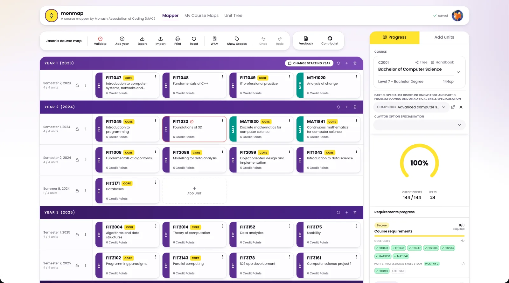

<div align="center">

# MonMap

**A course planner for Monash students, built by the [Monash Association of Coding](https://monashcoding.com).**

Meant to replace [MonPlan](https://monplan.apps.monash.edu), which is being sunset on 2 June 2026.

[**Live site**](https://monmap.monashcoding.com) · [Report a bug](https://github.com/monashcoding/monmap/issues) · [Feedback form](https://docs.google.com/forms/d/e/1FAIpQLSfEMCU4OCItlK6DGgIXTovH7_sPSW6mZtMaPGf1OCUQW_43kg/viewform)



</div>

## Overview

MonMap lets you drag units onto a year-by-year grid and see, in real
time, whether your plan actually works. It checks prereqs and slot
offerings against the actual Monash handbook, flags what doesn't fit,
surfaces what's missing from your course requirements, and keeps a
running WAM as you tweak. Sign in to save plans across devices, or use
it anonymously and export to JSON.

## Features

- **Quick unit search.** Two-pane layout with slot-fit hints and a
  recent-units rail so common picks are one click away.
- **Plans you own.** Export, re-import, print, or share. Your data
  travels with you.
- **Faithful handbook coverage.** Cross-year prereqs, honours track
  variations, and the trickier offering rules are all modelled
  explicitly.
- **Open source.** If something looks off for your course, read the
  code, file an issue, or send a PR.

## Getting started

Just visit [**monmap.monashcoding.com**](https://monmap.monashcoding.com).
No account required to start planning; sign in with your Monash Google
account to sync across devices.

## Contributing

PRs welcome. If you're a Monash student and something feels off about
how a unit, prereq, or course is rendered, that's almost always a bug
worth filing. Open an [issue](https://github.com/monashcoding/monmap/issues)
with the unit code and what you expected. For non-code feedback there's
a **Feedback** form linked in the app.

## Development

Single Next.js app backed by a local Postgres copy of the Monash
handbook. Handbook data ships with the repo as a packaged corpus
(`monmap-handbook-*.tar.gz`) so you don't need credentials to spin up a
working instance.

### Prerequisites

- Node ≥ 22 (tested on 25.8)
- pnpm ≥ 10
- Postgres ≥ 14 running locally

### First-time setup

```bash
# 1. Install workspace deps
pnpm install

# 2. Configure env at the repo root (one .env, see CLAUDE.md §1)
cp .env.example .env
# Edit DATABASE_URL if your Postgres isn't on localhost:5432/monmap

# 3. Create the database and apply migrations
createdb monmap
pnpm db:migrate

# 4. Unpack the handbook corpus into ./data
tar -xzf monmap-handbook-*.tar.gz

# 5. Load it into Postgres (~5k units, ~500 courses, ~10k offerings)
pnpm ingest
```

### Running the app

```bash
pnpm --filter webapp dev         # http://localhost:3000
```

### Day-to-day commands

```bash
pnpm db:generate                 # after editing schema.ts, write a new migration
pnpm db:migrate                  # apply pending migrations
pnpm db:studio                   # open drizzle-kit's db browser

pnpm --filter webapp test        # pure-function unit tests (node --test)
pnpm --filter webapp typecheck

pnpm scrape                      # re-scrape the live handbook for one year
pnpm scrape:all                  # …for every published year
pnpm package                     # roll a new monmap-handbook-YYYYMMDD.tar.gz
```

> `drizzle-kit push` is deliberately not wired up. Schema changes go
> through `db:generate` + `db:migrate` so the history stays auditable
> (CLAUDE.md §2).

### Project conventions and gotchas

- Repo-wide conventions: [`CLAUDE.md`](CLAUDE.md).
- Handbook data quirks (fields that silently lie, JSONB tree shapes,
  cross-year references): [`docs/handbook-internals.md`](docs/handbook-internals.md).
  Worth skimming before writing a query.

## Credits

Built and maintained by the [**MAC Projects team**](https://monashcoding.com/team)
at the [Monash Association of Coding](https://monashcoding.com).

Thanks to the MAC committee for backing the project, every Monash
student who's filed a bug or sent a screenshot, and the maintainers of
the open-source libraries we lean on.

## License

[AGPL-3.0-only](LICENSE). If you run a modified version of MonMap as a
network service, you must make your source available to its users.
Internal forks and private experimentation are fine; redistributing or
hosting a modified copy means publishing your changes under the same
license.
