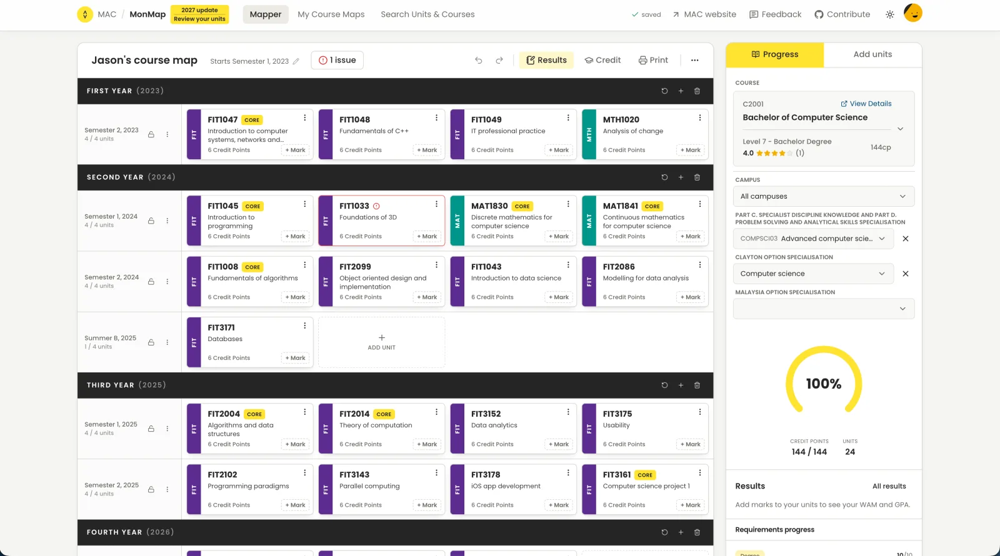

<div align="center">

# MonMap

**A course planner for Monash students, built by the [Monash Association of Coding](https://monashcoding.com).**

Built to replace [MonPlan](https://monplan.apps.monash.edu), which Monash sunset on 2 June 2026.

[**Live site**](https://monmap.monashcoding.com) · [Report a bug](https://github.com/monashcoding/monmap/issues) · [Feedback form](https://docs.google.com/forms/d/e/1FAIpQLSfEMCU4OCItlK6DGgIXTovH7_sPSW6mZtMaPGf1OCUQW_43kg/viewform)



</div>

## Overview

MonMap lets you drag units onto a year-by-year grid and see, in real
time, whether your plan works. It checks prerequisites and offerings
against the Monash handbook, flags what doesn't fit, shows what your
course requirements still need, and keeps a running WAM. Every unit,
course and major also has its own page with student reviews and a
requisite map. Sign in to save plans across devices, or use it
anonymously and export to JSON.

## Features

- **Quick unit search.** Two-pane layout with slot-fit hints and a
  recent-units rail so common picks are one click away.
- **Student reviews.** Rate units, courses and majors on teaching,
  content, assessment, difficulty and workload. Reviews show initials
  only, and a classifier screens out abuse, spam and personal details
  ([how it works](docs/reviews.md)).
- **Handbook pages and search.** A page for every unit, course and area
  of study from 2020 to 2027, with a requisite map of what each unit
  needs and unlocks, and one search over all of them
  ([details](docs/handbook-pages.md)).
- **Plans you own.** Export, re-import, print, or share. Your data
  travels with you.
- **Faithful handbook coverage.** Cross-year prereqs, honours track
  variations, and the trickier offering rules are all modelled
  explicitly.
- **Open source.** If something looks off for your course, read the
  code, file an issue, or send a PR.

## Getting started

Just visit [**monmap.monashcoding.com**](https://monmap.monashcoding.com).
No account required to start planning; sign in with your Monash Google
account to sync across devices.

## Contributing

PRs welcome. If you're a Monash student and something feels off about
how a unit, prereq, or course is rendered, that's almost always a bug
worth filing. Open an [issue](https://github.com/monashcoding/monmap/issues)
with the unit code and what you expected. For non-code feedback there's
a **Feedback** form linked in the app.

## Development

Single Next.js app backed by a local Postgres copy of the Monash
handbook. The handbook data is published as a tarball on
[GitHub Releases](https://github.com/monashcoding/monmap/releases), so
you don't need scraper credentials to spin up a working instance.

### Prerequisites

- Node ≥ 22 (tested on 25.8)
- pnpm ≥ 10
- Postgres ≥ 14 running locally

### First-time setup

```bash
# 1. Install workspace deps
pnpm install

# 2. Configure env at the repo root (one .env, see CLAUDE.md §1)
cp .env.example .env
# Edit DATABASE_URL if your Postgres isn't on localhost:5432/monmap

# 3. Create the database and apply migrations
createdb monmap
pnpm db:migrate

# 4. Download the latest handbook corpus from GitHub releases
#    (~120 MB; covers 2020–2026, the live site also has 2027).
#    Requires the gh CLI; alternatively
#    grab it from https://github.com/monashcoding/monmap/releases/latest
gh release download --repo monashcoding/monmap --pattern 'monmap-handbook-*.tar.gz'

# 5. Unpack into the scraper data directory
mkdir -p packages/scraper/data
tar -xzf monmap-handbook-*.tar.gz -C packages/scraper/data

# 6. Load every year into Postgres (~37k units, ~3k courses, ~70k
#    offerings across 7 academic years)
pnpm ingest:all
```

### Running the app

```bash
pnpm --filter webapp dev         # http://localhost:3000
```

On `localhost` you can't use your real MAC login: the shared
`.monashcoding.com` session cookie is never sent to `localhost`, so the
server renders you as signed out (the avatar may still show, because the
browser asks auth.monashcoding.com directly). To sign in locally, serve
the app from a `monashcoding.com` hostname instead:

1. Point `local.monashcoding.com` at your machine. Add these lines to
   `/etc/hosts` (needs `sudo`). The IPv6 line matters: without it the
   system still gets Cloudflare's IPv6 address from public DNS (the
   `*.monashcoding.com` wildcard), and browsers try IPv6 first.

   ```
   127.0.0.1 local.monashcoding.com
   ::1 local.monashcoding.com
   ```

2. Run the HTTPS dev server and open https://local.monashcoding.com:3000:

   ```bash
   pnpm dev:sso
   ```

   The first run creates a local certificate authority with `mkcert`
   and may ask for your password to trust it. The certificate lands in
   `packages/webapp/certificates/`, which is git-ignored.

The auth service must list `https://local.monashcoding.com:3000` in its
`TRUSTED_ORIGINS` setting (monashcoding/mac-auth). Its built-in
`https://*.monashcoding.com` wildcard does not match an origin with a
port, so without that entry sign-in and sign-out fail with "Invalid
origin" even though the session still shows.

Signed in this way, you read and write your real plans in whatever
database `DATABASE_URL` points at.

### Day-to-day commands

```bash
pnpm db:generate                 # after editing schema.ts, write a new migration
pnpm db:migrate                  # apply pending migrations
pnpm db:studio                   # open drizzle-kit's db browser

pnpm --filter webapp test        # pure-function unit tests (node --test)
pnpm --filter webapp typecheck

pnpm ingest                      # load a single year (default 2026) from ./packages/scraper/data
pnpm ingest:all                  # load every year present in the data dir
```

> `drizzle-kit push` is deliberately not wired up. Schema changes go
> through `db:generate` + `db:migrate` so the history stays auditable
> (CLAUDE.md §2).

### Cutting a new handbook release (maintainers)

The corpus on [GitHub Releases](https://github.com/monashcoding/monmap/releases)
is the canonical source for everyone's local Postgres. To refresh it,
re-scrape from CourseLoop and pack the result:

```bash
pnpm scrape:all                  # fetch every published year (slow, hours)
pnpm package                     # roll monmap-handbook-YYYYMMDD.tar.gz
gh release create handbook-YYYYMMDD monmap-handbook-YYYYMMDD.tar.gz \
  --title "Handbook snapshot: YYYY-YYYY (Month YYYY)"
```

### Project conventions and gotchas

- Repo-wide conventions: [`CLAUDE.md`](CLAUDE.md).
- Handbook data quirks (fields that silently lie, JSONB tree shapes,
  cross-year references): [`docs/handbook-internals.md`](docs/handbook-internals.md).
  Worth skimming before writing a query.
- Handbook pages, search and caching: [`docs/handbook-pages.md`](docs/handbook-pages.md).
- Reviews and moderation: [`docs/reviews.md`](docs/reviews.md).
- SEO: [`docs/seo.md`](docs/seo.md).

## Credits

Built and maintained by the [**MAC Projects team**](https://monashcoding.com/team)
at the [Monash Association of Coding](https://monashcoding.com).

Thanks to the MAC committee for backing the project, every Monash
student who's filed a bug or sent a screenshot, and the maintainers of
the open-source libraries we lean on.

## License

[AGPL-3.0-only](LICENSE). If you run a modified version of MonMap as a
network service, you must make your source available to its users.
Internal forks and private experimentation are fine; redistributing or
hosting a modified copy means publishing your changes under the same
license.
